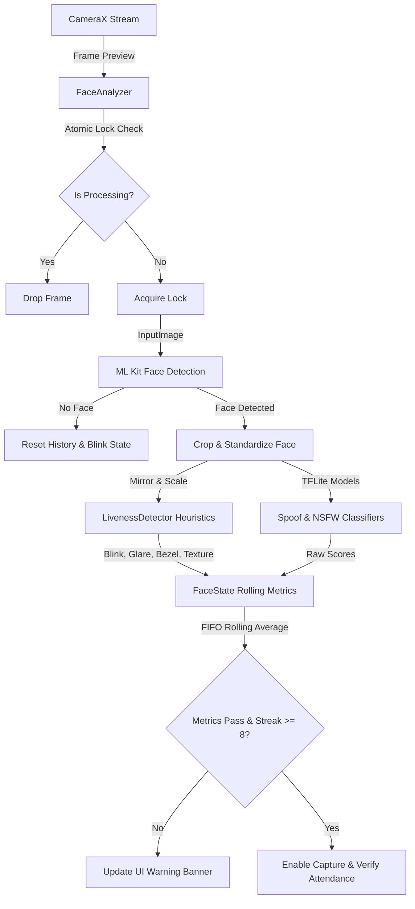

# PowerGrid Attendance System (PGAS)

An enterprise-grade, offline-first Android application designed for secure employee attendance verification. The system features a high-performance, real-time image analysis pipeline that implements advanced multi-heuristic Presentation Attack Detection (PAD) alongside deep-learning-based facial recognition.

---

## Key Features

### Presentation Attack Detection (PAD) / Anti-Spoofing
To prevent spoofing attacks (such as printed photographs, video replays, or screen displays), the application runs a multi-layered heuristics engine on every camera frame:
*   **Blink Sequence Tracking:** Monitors eye state probabilities (leftEyeOpenProbability and rightEyeOpenProbability) via ML Kit to ensure the subject performs a natural blink sequence (Open -> Closed -> Open).
*   **Device Bezel & Edge Scanning:** Applies Sobel gradient filters over an expanded region of interest (ROI) to detect parallel straight lines, identifying if a physical mobile screen is being presented to the camera.
*   **Moiré Texture Analysis:** Calculates high-frequency Laplacian variance to detect the distinct pixel grids or moiré interference patterns generated by digital displays.
*   **Specular Glare Filter:** Checks the brightness and saturation values in the HSV color space to distinguish cool-light glassy screen reflections from natural skin highlights.
*   **HSV Backlight Scanner:** Flags abnormally bright and desaturated face crops that are characteristic of LCD/OLED backlights.

### AI-Powered Face Recognition
*   **Deep Embedding Extraction:** Utilizes an optimized FaceNet model to convert face crops into 512-dimensional vector embeddings.
*   **Dual-Path Alignment Matcher:** Computes and compares embeddings for both normal and horizontally mirrored variants of the captured crop to resolve device-specific camera mirroring behaviors.
*   **Real-time Recognition Cache:** Stores computed employee embeddings in memory for fast, zero-latency cosine similarity comparisons during camera streaming.

### Optimized Frame Pipeline & Execution
*   **Asynchronous Processing:** Offloads ML Kit detection, crop transformations, and TFLite inference to background coroutines (Dispatchers.Default), keeping the UI thread fluid.
*   **Frame Overrun Protection:** Uses atomic flag guards (AtomicBoolean) to discard incoming frames if the background processor is busy, preventing pipeline backlogs.
*   **Zero-Allocation Inference:** Leverages pre-allocated native direct ByteBuffers and reusable pixel buffers in the TFLite interpreter to eliminate garbage collection overhead.
*   **Rolling-Window Stability Layer:** Runs a 10-frame FIFO sliding window that averages liveness, blur, and spoofing metrics. Verification requires a consecutive streak of 8 passing frames.

---

## Architecture & Control Flow

The diagrams below represent the frame processing and classification pipeline:



---

## Project Structure

```
app/src/main/java/com/example/powergridattendance/
│
├── MainActivity.kt               # Entry point, permission launcher, screen router
├── CameraScreen.kt               # Real-time preview UI, camera overlay, warning banners
├── CameraPreview.kt              # CameraX lifecycle binder & preview builder
│
├── FaceAnalyzer.kt               # ImageAnalysis.Analyzer implementation, runs pipeline
├── LivenessDetector.kt           # Image processing algorithms (Sobel, Laplacian, HSV, Blink)
├── TFLiteModelHelper.kt          # Zero-allocation TFLite loader & execution engine
├── FaceNetHelper.kt              # FaceNet model wrapper for feature extraction
├── RecognitionHelper.kt          # Manages employee database embeddings & cosine matching
│
├── FaceState.kt                  # State holder, rolling average calculator, verification rules
├── CameraState.kt                # Camera preview state monitoring
├── CurrentAttendanceSession.kt   # Tracks current verified session state
│
├── EmployeeRepository.kt         # JSON storage for registered employee cards
└── AttendanceRepository.kt       # JSON database for attendance records
```

---

## Getting Started

### Prerequisites
*   Android Studio Jellyfish (or newer)
*   Android SDK Platform 34
*   Gradle 8.2+
*   Kotlin 1.9+

### Setup Assets
To run the classifiers, you must place the corresponding TensorFlow Lite models in the assets directory:
```
app/src/main/assets/
├── spoof_model.tflite            # Spoofing/liveness detection classifier
├── nsfw_model.tflite             # Safety/NSFW pre-filter model
└── facenet_model.tflite          # FaceNet feature embedding model
```

### Installation
1.  Clone the repository:
    ```bash
    git clone https://github.com/jyotibagdi-07/powergridattendenceapp.git
    ```
2.  Open the project in Android Studio.
3.  Sync project with Gradle Files.
4.  Build and deploy the application to a physical test device with Camera capabilities.

---

## Technical Deep Dive & Algorithms

### Sobel-Based Edge Detection
To identify screen bezels, the edge detector computes structural horizontal and vertical gradients over the margin segments of the region of interest:
```kotlin
val gx = (gray[idx + 1 - width] - gray[idx - 1 - width]) +
         2f * (gray[idx + 1] - gray[idx - 1]) +
         (gray[idx + 1 + width] - gray[idx - 1 + width])

val gy = (gray[idx - 1 + width] - gray[idx - 1 - width]) +
         2f * (gray[idx + width] - gray[idx - width]) +
         (gray[idx + 1 + width] - gray[idx + 1 - width])
```
Line peaks are accumulated outside the central facial rectangle. Two parallel vertical or horizontal peaks confirm the boundary markers of a spoof screen.

### Laplacian Variance
Sharpness and texture grid structures are computed by convolving the image with the standard Laplacian aperture kernel:
```kotlin
val laplacian = (4 * center - left - right - top - bottom).toDouble()
laplacianSum += laplacian * laplacian
```
The variance of these values is compared to bounds: low variance indicates high blurriness (rejected), while abnormally high variance ($>1600$) indicates a digital display's pixel array grid (rejected).

### TFLite Dynamic Model Adaptation
The helper maps model buffers directly and dynamically evaluates the shape structure of the input tensors:
```kotlin
val inputShape = interpreter?.getInputTensor(0)?.shape()
isNCHW = inputShape[1] == numChannels
```
If planar layouts are indicated, pixels are packed as sequential planes:
$$\text{Buffer} = [R_1, R_2, \dots, G_1, G_2, \dots, B_1, B_2, \dots]$$
Otherwise, standard interleaved formatting is used:
$$\text{Buffer} = [R_1, G_1, B_1, R_2, G_2, B_2, \dots]$$

---

## Security & Privacy
*   **Local Processing:** All biometric comparisons and image analyses are performed entirely on-device. No face bitmaps, feature vectors, or personal details are uploaded to remote servers.
*   **Secure Storage:** Registered cards and verification records are stored within the application's private sandbox directory, protected by system-level sandboxing.
